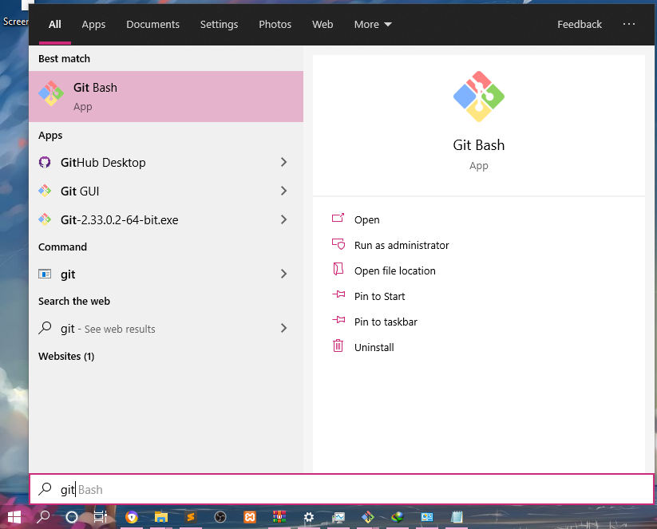

# Install Git
## Download Git

1. Download Software Git di [link ini](https://git-scm.com) seperti gambar dibawah.


2. Setelah itu, Install software Git tersebut sesuai kebutuhan seperti lokasi instalasi dan lain lain. Jika tidak ada kebutuhan yang spesifik install secara default saja dengan klik **next** terus.


3. Tungu hingga instalasi selesai. Jika sudah selesai klik **Finish**.

4. Untuk cek apakah sudah terinstall, bisa dengan buka command prompt, setelah itu eksekusi "git --version". Jika sudah terinstall dengan benar, makan akan muncul versi dari git yang terinstall seperti dibawah.


## Konfigurasi

1. Jalankan Git dengan klik Start menu, ketikkan "Git", Pilih "Git Bash".



2. Kemudian konfigurasi username dan email yang telah terdaftar di GitHub menggunakan perintah berikut:

```
$ git config --global user.name "Nama Anda di GitHub"
$ git config --global user.email email@domain.tld
```