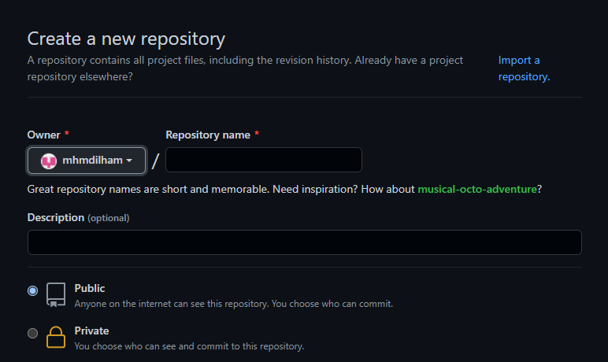

# Mengelola Repository 

## Membuat Repo

1. Klik tanda **plus/tambah** di pojok kanan atas kemudian klik **new repository**.



2. Kemudian isikan Nama, keterangan dan opsi lainnya seperti kebutuhan.

3. Klik **Create Repository** jika sudah.

## Mengelola Repo

1. Clone repo dari Github ke penyimpanan lokal dengan perintah di bawah.

```
$ git clone https://github.com/mhmdilham/cobapraktik
```

2. Ubah repo sesuai yang diinginkan seperti menambah file, foto atau mengubah isi README.md

3. Setelah merubah isi dari repo contohnya merubah isi README.md, lakukan update dari repo lokal ke online dengan command seperti dibawah.

```
$ git status
```
Untuk melihat status dari repo.

```
$ git add -A
```
Untuk memindahkan semua file ke dalam staging area.

```
$ git commit -m "Add: README.md"
```
Untuk memindahkan file dari staging area ke history.

```
$ git push origin main
```
Untuk melakukan push atau update dari history ke repo online seperti GitHub.


## Update repo lokal dengan repo online

Perintah ini digunakan untuk mengupdate repo di pengimpanan lokal dengan repo online seperti GitHub. Untuk perintahnya seperti dibawah.

```
$ git pull
```

